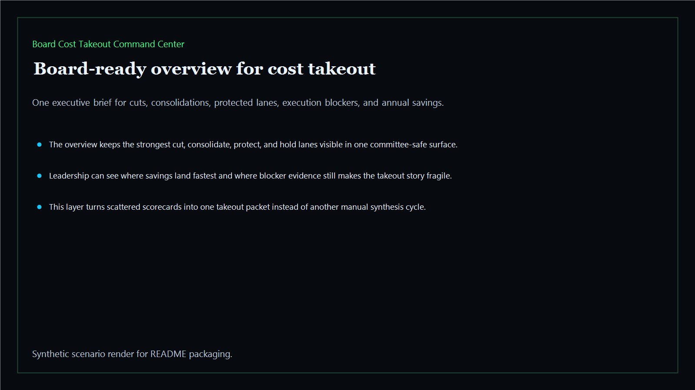
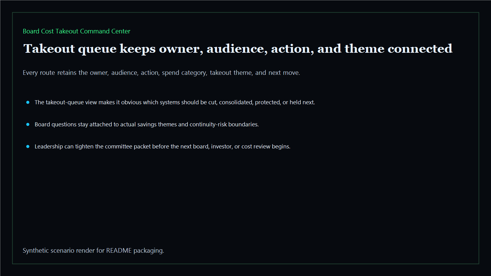
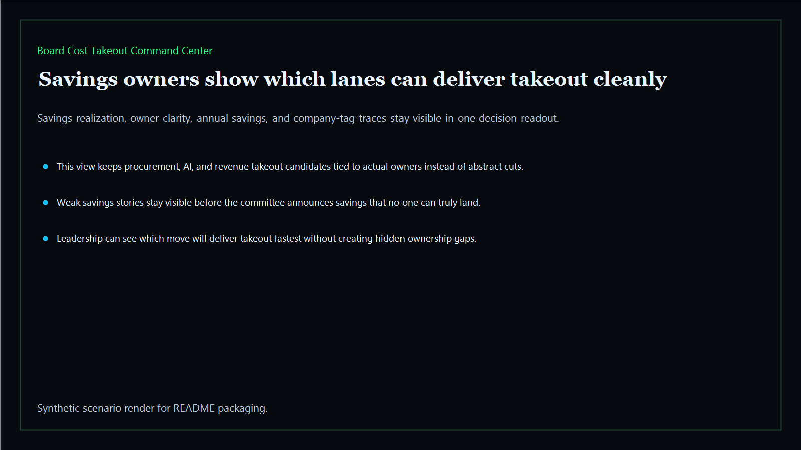
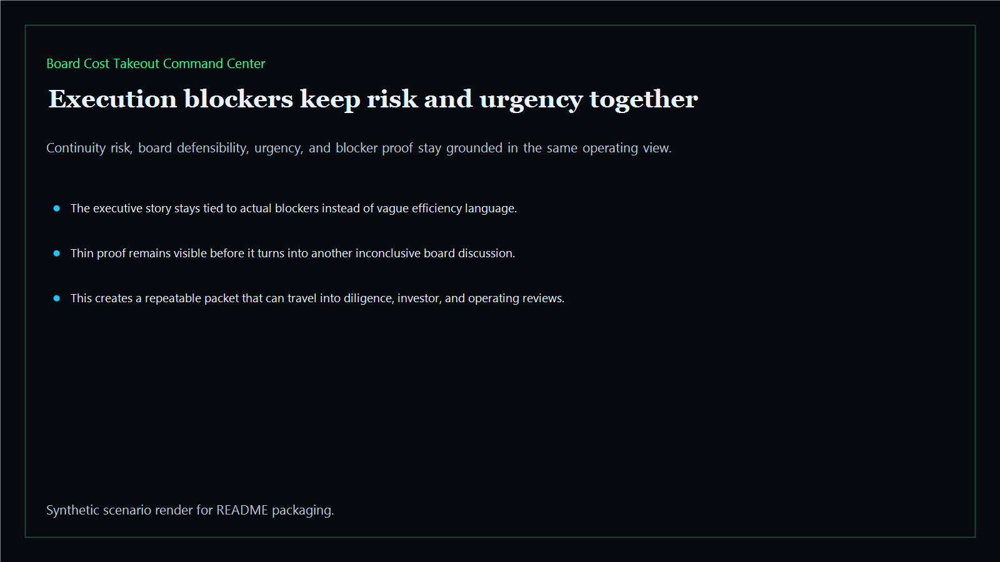

# Board Cost Takeout Command Center

Board-ready cost-takeout command center for sequencing savings owners, execution blockers, and takeout proof across the executive estate.

- Live: `https://takeout.kineticgain.com/`
- Repo: `mizcausevic-dev/board-cost-takeout-command-center`

## Why this matters

Leaders need more than a generic budget cut list. They need one command surface that shows what should be cut, what should be consolidated, what must be protected, and where execution blockers still make the savings story hard to defend.

## Product depth

- TypeScript executive-intelligence surface for cost takeout with modeled savings realization, execution complexity, continuity risk, owner clarity, board defensibility, and urgency signals
- synthetic executive lanes across AI, identity, revenue, FinTech, biotech, procurement, and public-sector readiness
- reusable outputs for takeout queues, savings-owner packets, execution blockers, and board-ready risk maps
- prerendered static site, JSON payloads, screenshots, and docs
- buyer-readable cost-takeout narrative that separates clean savings from cuts that would damage revenue capacity, compliance proof, trust, or continuity
- technical proof layer with typed routes, fixtures, JSON payloads, smoke checks, and static outputs that can be inspected instead of trusted as slideware

## What these repos have in common

Kinetic Gain executive-intelligence repos turn operational complexity into a consistent decision packet: owner, risk, evidence, decision, and next action. The point is not another generic dashboard. The point is a reusable proof surface that helps leaders explain where they are exposed, where savings are credible, where investment is safer than cuts, and what story can stand up in front of a board or investor.

## Operating workflow

1. Load the takeout packet from the fixture or JSON route.
2. Review the queue by action: cut, consolidate, protect, or hold.
3. Compare savings realization against continuity risk and owner clarity.
4. Turn blocker findings into owner-specific next actions.
5. Re-run verification before the packet is reused in an executive or board setting.

## Routes

- `/`
- `/takeout-queue`
- `/savings-owners`
- `/execution-blockers`
- `/verification`
- `/docs`

## Local run

```bash
cd board-cost-takeout-command-center
npm install
npm run verify
npm run prerender
npm run render:assets
```

## CLI

```bash
npx board-cost-takeout-command-center fixtures/board-cost-takeout-command-center.json --format summary
npx board-cost-takeout-command-center fixtures/board-cost-takeout-command-center-clean.json --format json
```

## Docs

- [Architecture](docs/architecture.md)
- [Origin](docs/ORIGIN.md)
- [Kinetic Gain Embedded](docs/KINETIC_GAIN_EMBEDDED.md)

## Screenshots






